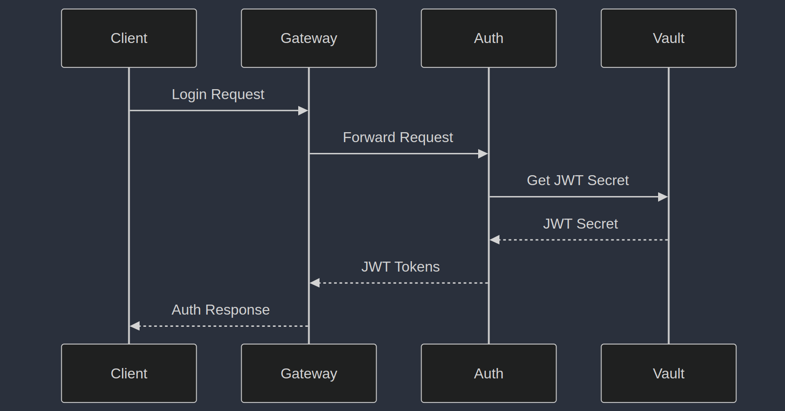
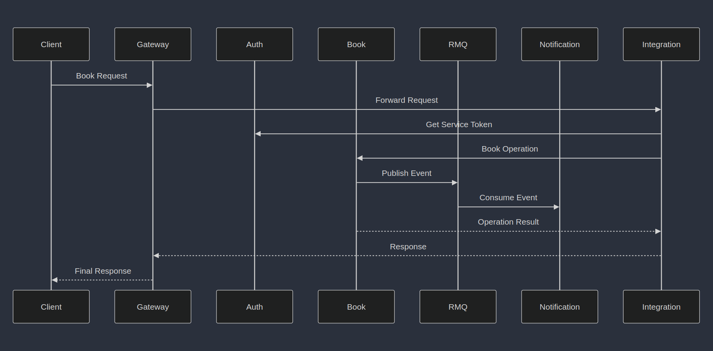
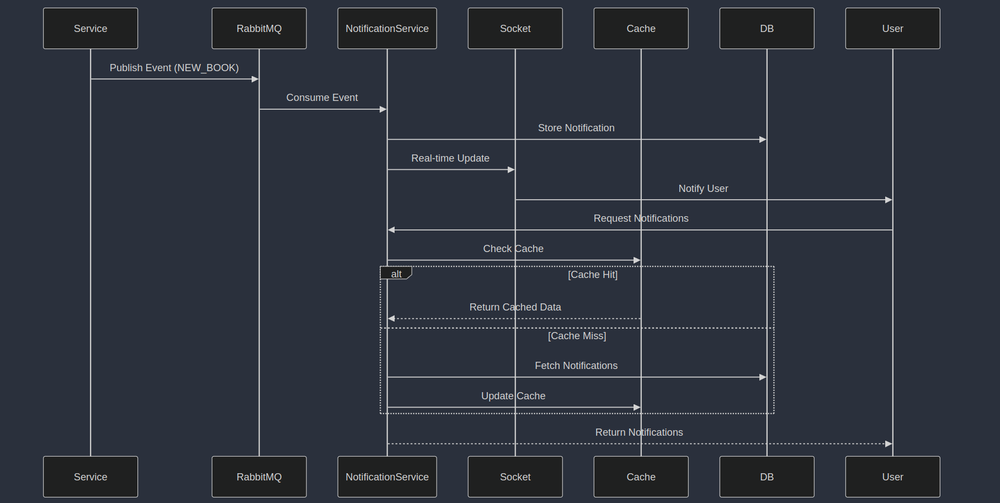
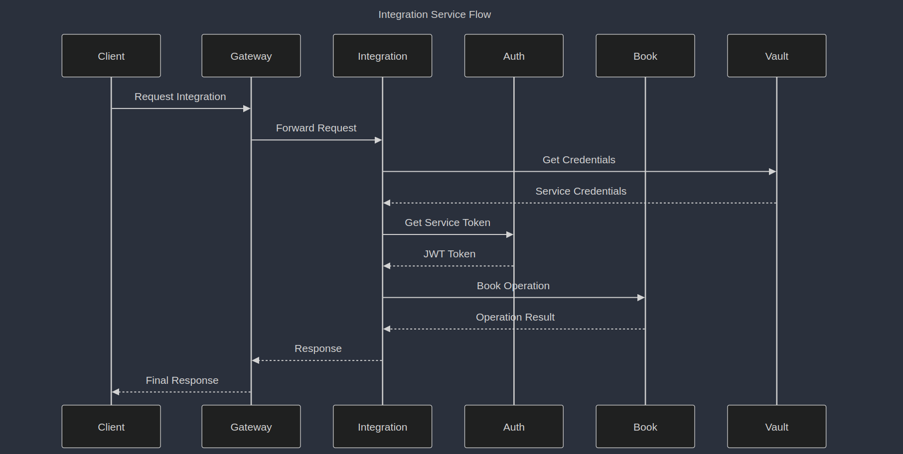
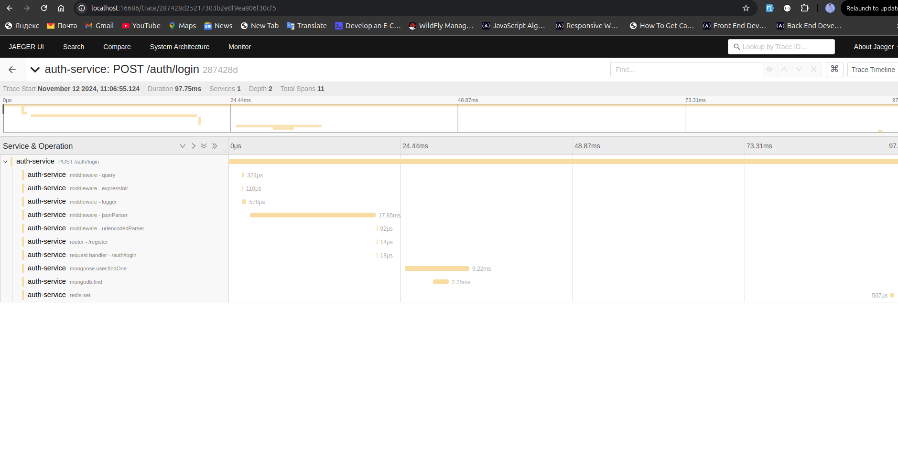

# Bookstore Microservices Documentation
## Service Overview
### 1. API Gateway (Port: 9000)
- Single entry point for all client requests
- Route management
- Rate limiting
- Request logging
### 2. Auth Service (Port: 5000)
- User authentication and token generation
- JWT token verification
- User registration and login
- Password hashing and salting
- Service account management
### 3. Book Service (Port: 8080)
- Book management and retrieval
- Integration with external API
- Caching mechanisms
- Error handling and logging
- Bulk operations support
### 4. Integration Service (Port: 8000)
- External API integration
- Authentication with Auth Service
- Request forwarding and response handling
- Error handling and logging
- Service token management
- Cross-service data synchronization
### 5. Notification Service (Port: 6001)
- Event-based notifications
- Real-time updates
## Technology Stack
### Core Technologies
- **Runtime**: Node.js
- **Framework**: Express
- **Gateway**: Express Gateway
- **Database**: MongoDB
- **Caching**: Redis
- **API Documentation**: Swagger
- **Message Queue**: RabbitMQ
- **Secret Management**: Vault
### Common Libraries
- **Validation**: Joi
- **Error Handling**: http-errors
- **HTTP Client**: axios
- **Documentation**: swagger-jsdoc, swagger-ui-express
## Service Communication
### Authentication Flow

### Book Operation Flow

### Notification Flow

### Integrator Flow

## Setup Instructions
### Prerequisites
- Node.js (v16 or higher)
- Redis
- Hashicorp Vault
- MongoDB
- RabbitMQ
### Environment Setup
1. Start Infrastructure Services:
```bash
# Start MongoDB
mongod

# Start RabbitMQ
rabbitmq-server

# Start Vault
vault server -dev

# Start Redis
redis-server
```
2. Clone and Setup Services:
```bash
git clone <repository_url>
cd bookstore-api

# Setup each service
cd services/auth-service && npm install
cd ../book-service && npm install
cd ../integration-service && npm install
cd ../notification-service && npm install
cd ../api-gateway && npm install
```
3. Configure Vault
```bash
# Set Vault Address
export VAULT_ADDR='http://127.0.0.1:8201'

# Initialize services
cd services/auth-service && npm run setup
cd ../book-service && npm run setup
cd ../integration-service && npm run setup
cd ../notification-service && npm run setup
```
4. Start Services
```bash
cd services/auth-service && npm start
cd ../book-service && npm start
cd ../integration-service && npm start
cd ../notification-service && npm start
cd ../api-gateway && npm start
```
## API Documentation
### Access Points
- API Gateway: http://localhost:9000
- Auth Service: http://localhost:5000/api-docs
- Book Service: http://localhost:8080/api-docs
- Integration Service: http://localhost:8000/api-docs
- Notification Service: http://localhost:6001/api-docs
## Security
### Authentication
- JWT-based authentication
- Service-to-service authentication
- Token refresh mechanism
- Role-based access control
### Secret Management
- Centralized secret management with Vault
- Service-specific secret paths
- Automated secret rotation
- Secure credential storage
## Logging and Monitoring
### Distributed Tracing with Jaeger
The project uses OpenTelemetry with Jaeger for distributed tracing and monitoring across all services.

#### Starting Jaeger
```bash
# Navigate to jaeger directory
cd jaeger

# Start Jaeger
./jaeger-all-in-one
```

#### Accessing Jaeger UI
- URL: `http://localhost:16686`
- Features:
  - Distributed tracing visualization
  - Service dependency graphs
  - Performance metrics
  - Error tracking
  - Request flow analysis

### Jaeger UI


#### Traced Services
- Auth Service (:5000)
- Book Service (:8080)
- Integration Service (:8000)
- Notification Service (:6001)
- API Gateway (:9000)


#### Key Monitoring Features
1. **Request Tracing**
   - End-to-end request flow
   - Service dependencies
   - Response times
   - Error tracking

2. **Performance Metrics**
   - Service latency
   - Database operations
   - External API calls
   - Resource usage

3. **Error Analysis**
   - Error rates
   - Error types
   - Error locations
   - Stack traces

4. **Service Dependencies**
   - Inter-service communication
   - API calls
   - Database queries
   - Message queue operations

## Shared Module Setup

The project uses a shared GitHub submodule for common functionality across services.

### Initial Setup

```bash
#Clone the main repository with submodules
git clone --recursive https://github.com/Mehretu/bookstore-api.git

# OR if you already cloned without submodules
git clone https://github.com/Mehretu/bookstore-api.git
cd bookstore-api
git submodule update --init --recursive
```